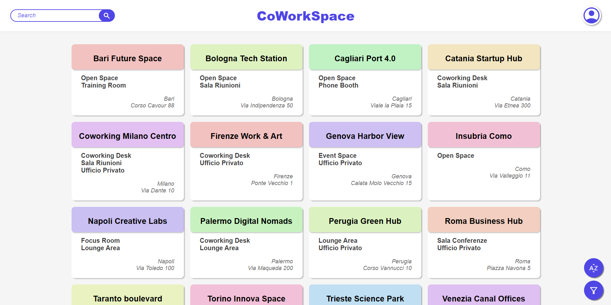

# CoWorkSpace - Piattaforma di Gestione Spazi di Coworking

## 📋 Panoramica
CoWorkSpace è una piattaforma all-in-one per la gestione di spazi di coworking che integra prenotazioni, pagamenti e gestione delle sedi. Il sistema è progettato per supportare multiple stakeholder: amministratori, manager di spazi e utenti finali.

## 📍 Accesso
Il sito è accessibile all'indirizzo: [CoWorkSpace](https://coworkspace-1.onrender.com/home.html)

## 🏠 Home del sito


## 🎯 Obiettivi del Progetto
- Semplificare la gestione degli spazi di coworking
- Automatizzare il processo di prenotazione
- Fornire un sistema di pagamento sicuro e flessibile
- Garantire una user experience ottimale

## 🚀 Caratteristiche Principali

### 👥 Sistema Multi-Ruolo
#### Amministratori
- Gestione completa della piattaforma
- Gestione utenti e permessi
- Configurazione parametri sistema
- Monitoraggio sistema

#### Manager
- Gestione spazi assegnati
- Gestione prenotazioni
- Personalizzazione servizi
- Gestione disponibilità

#### Utenti
- Ricerca e prenotazione spazi
- Gestione profilo personale
- Storico prenotazioni/pagamenti
- Gestione prenotazioni personali

### 🏢 Gestione Spazi
#### Tipologie Supportate
- Uffici privati
- Sale riunioni
- Postazioni hot-desk
- Spazi eventi
- Aree comuni

#### Funzionalità Spazi
- Calendario disponibilità real-time
- Prenotazioni singole
- Servizi aggiuntivi
- Gestione prezzi
- Gestione disponibilità

### 🔐 Sistema di Autenticazione
#### Metodi di Accesso
- Email/Password
- OAuth (Google, Facebook) via Firebase
- JWT per sessioni

#### Gestione Password
1. **Reset Standard**
   - Link temporaneo via email
   - Validazione nuova password
   - Notifica email di conferma

### 📅 Sistema Prenotazioni
#### Processo di Booking
1. **Ricerca Spazi**:
   - Filtri base (location, data)
   - Calendario disponibilità
   - Visualizzazione prezzi

2. **Prenotazione**:
   - Selezione data/ora
   - Servizi base
   - Verifica disponibilità

3. **Gestione**:
   - Conferma prenotazione
   - Notifiche email
   - Cancellazione

### 💳 Sistema Pagamenti
#### Metodi di Pagamento
- Carte credito/debito
- PayPal
- Bonifico bancario

#### Processo Transazioni
1. Selezione metodo
2. Verifica importo
3. Processamento
4. Notifica conferma

## 🛠️ Stack Tecnologico

### Backend
- **Runtime**: Node.js v16+
- **Framework**: Express.js
- **Database**: PostgreSQL
- **Auth**: Firebase Auth
- **Testing**: Jest
- **API**: RESTful

### Frontend
- **HTML5/CSS3**
- **JavaScript Vanilla**
- **Template HTML statici**

### DevOps
- **Container**: Docker
- **Database**: PostgreSQL in container
- **Versionamento**: Git
- **Documentation**: LaTeX

### Strumenti di Sviluppo
- **Testing**: Jest
- **API Documentation**: Swagger
- **Database Scripts**: SQL
- **Email Templates**: HTML


## 📁 Architettura del Progetto
```
CoWorkSpace/
├── src/
│   ├── backend/           
│   │   ├── controllers/   # Gestione logica delle richieste HTTP
│   │   │   ├── adminController.js
│   │   │   ├── availabilityController.js
│   │   │   ├── bookingController.js
│   │   │   ├── locationController.js
│   │   │   ├── managerController.js
│   │   │   ├── notificationController.js
│   │   │   ├── paymentController.js
│   │   │   ├── spaceController.js
│   │   │   ├── spaceTypeController.js
│   │   │   └── userController.js
│   │   ├── services/      # Logica di business
│   │   │   ├── AuthService.js
│   │   │   ├── AvailabilityService.js
│   │   │   ├── BookingService.js
│   │   │   ├── LocationService.js
│   │   │   ├── NotificationService.js
│   │   │   ├── PaymentService.js
│   │   │   ├── SpaceService.js
│   │   │   └── SpaceTypeService.js
│   │   ├── models/        # Modelli database
│   │   │   ├── Availability.js
│   │   │   ├── Booking.js
│   │   │   ├── Location.js
│   │   │   ├── Notification.js
│   │   │   ├── Payment.js
│   │   │   ├── Space.js
│   │   │   ├── SpaceType.js
│   │   │   ├── User.js
│   │   │   └── index.js
│   │   ├── routes/        # Definizione routes API
│   │   │   ├── adminRoutes.js
│   │   │   ├── availabilityRoutes.js
│   │   │   ├── bookingRoutes.js
│   │   │   ├── locationRoutes.js
│   │   │   ├── managerRoutes.js
│   │   │   ├── notificationRoutes.js
│   │   │   ├── paymentRoutes.js
│   │   │   ├── spaceRoutes.js
│   │   │   ├── spaceTypeRoutes.js
│   │   │   └── userRoutes.js
│   │   ├── middleware/    # Middleware per auth e validazione
│   │   │   ├── authMiddleware.js
│   │   │   └── validators/
│   │   ├── config/        # File di configurazione
│   │   │   ├── db.js
│   │   │   ├── firebase.js
│   │   │   └── swagger.js
│   │   ├── templates/     # Template email
│   │   │   ├── booking_cancellation.html
│   │   │   ├── booking_confirmation.html
│   │   │   ├── manager_approval.html
│   │   │   └── manager_rejection.html
│   │   └── utils/         # Utilità condivise
│   │       └── apiResponse.js
│   └── frontend/          # Interface web
│       ├── dashboard-admin.html
│       ├── dashboard-manager.html
│       ├── home.html
│       ├── index.html
│       ├── login.html
│       ├── profile.html
│       ├── reset-password.html
│       ├── signup.html
│       ├── workspace.html
│       ├── js/
│       └── styles/
├── tests/                 # Test
│   ├── unit/             # Test unitari servizi
│   │   ├── AuthService.test.js
│   │   ├── AvailabilityService.test.js
│   │   ├── BookingService.test.js
│   │   ├── LocationService.test.js
│   │   ├── NotificationService.test.js
│   │   ├── PaymentService.test.js
│   │   ├── SpaceService.test.js
│   │   └── SpaceTypeService.test.js
│   ├── helpers/          # Utility per test
│   │   └── testApp.js
│   └── setup.js
├── docs/
│   └── images/                 
│   └── latex/
│       ├── API/          # Documentazione API
│       └── Database/     # Documentazione DB
├── docker-compose.yml    # Configurazione Docker
├── Dockerfile           # Build container
├── package.json         # Dipendenze e script
└── jest.config.json    # Configurazione test
```

## 🚀 Setup Ambiente

### Prerequisiti
- Node.js (v16+)
- Docker Desktop

### Installazione locale
```bash
# Clone repository
git clone https://github.com/IlTetta/CoWorkSpace.git
cd CoWorkSpace

# Setup ambiente
Richiedere all admin file .env

# Installazione dipendenze
npm install

# Avvio servizi Docker
docker-compose up -d

# Avvio production
npm run start
```

### Terminare il server locale
```bash
# Arresto server
docker-compose down
```

## 📊 Database

### File SQL Principali
- `init.sql`: Schema iniziale del database
- `seed_data.sql`: Dati di esempio per sviluppo

### Configurazione
Gestita automaticamente via Docker Compose

## 🧪 Testing

### Comandi
```bash
# Tutti i test
npm test

# Test specifico servizio
npm test AuthService

# Coverage
npm test -- --coverage
```
## 💻 Convenzioni di Codice
- **Controllers**: Gestione richieste HTTP e risposte
- **Services**: Logica di business
- **Models**: Definizione schema database
- **Routes**: Definizione endpoint API
- **Middleware**: Autenticazione e validazione


### Metriche Qualità
- **Unit Tests**: 85%+ coverage
- **Business Logic**: Test completi
- **Mock System**: DB, Firebase, Email
- **Performance**: ~10s esecuzione

## 🔐 Sicurezza
- Autenticazione Firebase
- JWT per le sessioni
- Middleware di autorizzazione
- Validazione input

## 📑 Documentazione
- **API**: Swagger docs disponibili su `/api-docs`
- **Database**: Schema in `/docs/latex/Database/`
- **API Docs**: Documentazione completa in `/docs/latex/API/`


