# 🔄 Refactoring Sistema Ruoli Utente - CoWorkSpace

## 📋 Panoramica delle Modifiche

Questo documento descrive il refactoring completo del sistema di gestione dei ruoli utente implementato il 9 settembre 2025. Il sistema è passato da una registrazione diretta con ruolo specificato a un sistema di richiesta e approvazione per il ruolo manager.

## 🎯 Obiettivi del Refactoring

1. **Eliminare la scelta diretta del ruolo** durante la registrazione
2. **Implementare un sistema di richiesta manager** con flag booleano
3. **Creare un utente admin predefinito** con credenziali note
4. **Bloccare il login** per utenti con richiesta manager pending
5. **Implementare workflow di approvazione/rifiuto** per gli admin

## 📊 Schema del Nuovo Flusso

```mermaid
flowchart TD
    A[Registrazione Utente] --> B{requestManagerRole?}
    B -->|false/undefined| C[Utente Normale]
    B -->|true| D[Richiesta Manager Pending]
    
    C --> E[Login Immediato ✅]
    D --> F[Login Bloccato ❌]
    
    F --> G[Email all'Admin]
    G --> H{Admin Decision}
    
    H -->|Approva| I[Promozione a Manager]
    H -->|Rifiuta| J[Rimane Utente Normale]
    
    I --> K[Login Abilitato - Privilegi Manager ✅]
    J --> L[Login Abilitato - Privilegi User ✅]
```



## 🗄️ Modifiche al Database

### File: `init.sql`

#### Nuovi Campi Tabella Users
```sql
-- Campi aggiunti alla tabella users
role user_role_enum NOT NULL DEFAULT 'user',  -- Default invece di obbligatorio
manager_request_pending BOOLEAN DEFAULT FALSE,
manager_request_date TIMESTAMP,
```

#### Utente Admin Predefinito
```sql
-- Credenziali admin preconfigurate
INSERT INTO users (name, surname, email, password_hash, role) 
VALUES (
  'Admin',
  'CoWorkSpace', 
  'admin@coworkspace.com',
  '$2b$12$3QkdEdtpCfqQrm74UK.6AuQTrZH/jI683J1f0CkpwvS30lZEWn9pG', -- CoWorkSpace2025!
  'admin'
) ON CONFLICT (email) DO NOTHING;
```

**🔑 Credenziali Admin:**
- **Email:** `admin@coworkspace.com`
- **Password:** `CoWorkSpace2025!`

## 🏗️ Modifiche Backend

### 1. Model User.js

#### Nuovi Campi Costruttore
```javascript
constructor(userData) {
    // ... campi esistenti ...
    this.manager_request_pending = userData.manager_request_pending || false;
    this.manager_request_date = userData.manager_request_date;
}
```

#### Metodo `create()` Modificato
```javascript
static async create(userData) {
    const { name, surname, email, password, requestManagerRole } = userData;
    
    // Rimosse validazioni ruolo
    this.validateUserData({ name, surname, email, password });
    
    // Gestione richiesta manager
    const manager_request_pending = requestManagerRole || false;
    const manager_request_date = requestManagerRole ? new Date() : null;
    
    // Tutti gli utenti iniziano come 'user'
    // ...
}
```

#### Nuovo Metodo `verifyPasswordForLogin()`
```javascript
async verifyPasswordForLogin(password) {
    // BLOCCO LOGIN per richieste manager pending
    if (this.manager_request_pending) {
        return { 
            isValid: false, 
            managerRequestPending: true,
            message: 'Il tuo account è in attesa di approvazione...'
        };
    }
    // ... resto della logica ...
}
```

#### Nuovi Metodi Gestione Manager
```javascript
static async approveManagerRequest(userId)     // Approva e promuove a manager
static async rejectManagerRequest(userId)      // Rifiuta ma mantiene come user
static async getPendingManagerRequests()       // Lista richieste pending
```

### 2. Service AuthService.js

#### Metodo `register()` Aggiornato
```javascript
static async register(userData) {
    const user = await User.create(userData);

    // Se richiesta manager pending, NON genera token
    if (user.manager_request_pending) {
        return {
            token: null,
            user: user.toJSON(),
            message: 'Registrazione completata. La tua richiesta...',
            canLogin: false
        };
    }
    
    // Utenti normali ottengono il token immediatamente
    // ...
}
```

#### Metodo `login()` Aggiornato
```javascript
static async login(email, password) {
    // ... trova utente ...
    
    const passwordCheck = await user.verifyPasswordForLogin(password);
    
    if (!passwordCheck.isValid) {
        if (passwordCheck.managerRequestPending) {
            throw AppError.forbidden(passwordCheck.message);
        }
        // ... altri controlli ...
    }
    // ...
}
```

#### Nuovi Metodi Admin
```javascript
static async getPendingManagerRequests(adminUser)
static async approveManagerRequest(userId, adminUser)  
static async rejectManagerRequest(userId, adminUser)
```

### 3. Controller userController.js

#### Endpoint `register` Modificato
```javascript
exports.register = catchAsync(async (req, res, next) => {
    const { name, surname, email, password, requestManagerRole } = req.body;
    
    const result = await AuthService.register({
        name, surname, email, password,
        requestManagerRole: requestManagerRole || false
    });

    // Email benvenuto standard
    await NotificationService.sendUserRegistration(result.user);

    // Email all'admin se richiesta manager
    if (result.user.manager_request_pending) {
        await NotificationService.sendManagerRequestNotification(result.user);
    }

    const statusCode = result.canLogin ? 201 : 202;
    // ...
});
```

#### Nuovi Endpoint Admin
```javascript
exports.getPendingManagerRequests    // GET /users/manager-requests/pending
exports.approveManagerRequest        // PATCH /users/:id/approve-manager  
exports.rejectManagerRequest         // PATCH /users/:id/reject-manager
```

### 4. Routes userRoutes.js

#### Nuove Rotte
```javascript
// Admin-only routes
router.get('/manager-requests/pending', 
    authMiddleware.protect, 
    authMiddleware.authorize('admin'), 
    userController.getPendingManagerRequests
);

router.patch('/:user_id/approve-manager', 
    authMiddleware.protect, 
    authMiddleware.authorize('admin'), 
    userController.approveManagerRequest
);

router.patch('/:user_id/reject-manager', 
    authMiddleware.protect, 
    authMiddleware.authorize('admin'), 
    userController.rejectManagerRequest
);
```

### 5. Validator authValidator.js

#### Validazione Registrazione Aggiornata
```javascript
exports.registerValidation = [
    body('name').trim().notEmpty().withMessage('Nome obbligatorio.'),
    body('surname').trim().notEmpty().withMessage('Cognome obbligatorio.'),
    body('email').isEmail().withMessage('Email non valida.').normalizeEmail(),
    body('password')/* password rules */,
    // RIMOSSO: body('role').isIn(['user', 'manager', 'admin'])
    // AGGIUNTO:
    body('requestManagerRole')
        .optional()
        .isBoolean().withMessage('requestManagerRole deve essere un valore booleano')
];
```

## 📧 Sistema Notifiche

### Service NotificationService.js

#### Nuovi Metodi Email
```javascript
// Per l'admin quando arriva richiesta
static async sendManagerRequestNotification(user)

// Per l'utente quando viene approvato
static async sendManagerApprovalNotification(user)  

// Per l'utente quando viene rifiutato
static async sendManagerRejectionNotification(user)
```

### Nuovi Template Email

#### 1. `manager_request_notification.html`
- **Destinatario:** Admin
- **Scopo:** Notifica nuova richiesta manager
- **Contenuto:** Dati utente, link al pannello admin

#### 2. `manager_approval.html`
- **Destinatario:** Utente
- **Scopo:** Conferma promozione a manager
- **Contenuto:** Congratulazioni, nuovi privilegi, link login

#### 3. `manager_rejection.html`
- **Destinatario:** Utente  
- **Scopo:** Comunicazione rifiuto richiesta
- **Contenuto:** Spiegazione, possibilità di usare come user normale

## 🔄 Stati e Transizioni

### Stati Possibili
```javascript
// Durante registrazione
{
  role: 'user',
  manager_request_pending: false  // → Login OK
}

{
  role: 'user', 
  manager_request_pending: true   // → Login BLOCCATO
}

// Dopo approvazione
{
  role: 'manager',
  manager_request_pending: false  // → Login OK + Privilegi Manager
}

// Dopo rifiuto  
{
  role: 'user',
  manager_request_pending: false  // → Login OK + Privilegi User
}
```

### Matrice Transizioni

| Stato Iniziale | Azione Admin | Stato Finale | Login | Privilegi |
|----------------|--------------|--------------|-------|-----------|
| `user + pending=true` | **Approva** | `manager + pending=false` | ✅ | Manager |
| `user + pending=true` | **Rifiuta** | `user + pending=false` | ✅ | User |
| `user + pending=false` | - | `user + pending=false` | ✅ | User |

## 🔌 API Endpoints

### Registrazione Aggiornata
```http
POST /users/register
Content-Type: application/json

{
  "name": "Mario",
  "surname": "Rossi", 
  "email": "mario@example.com",
  "password": "Password123!",
  "requestManagerRole": true  // ← NUOVO CAMPO
}
```

**Responses:**
- `201` - Utente normale (può fare login)
- `202` - Richiesta manager (login bloccato)

### Nuovi Endpoint Admin
```http
# Lista richieste pending
GET /users/manager-requests/pending
Authorization: Bearer <admin-token>

# Approva richiesta  
PATCH /users/123/approve-manager
Authorization: Bearer <admin-token>

# Rifiuta richiesta
PATCH /users/123/reject-manager  
Authorization: Bearer <admin-token>
```

## 🔍 Testing e Validazione

### Test Cases Principali

1. **Registrazione Normale**
   ```javascript
   POST /users/register
   { requestManagerRole: false }
   // Expect: 201, token presente, login immediato
   ```

2. **Registrazione con Richiesta Manager**
   ```javascript  
   POST /users/register
   { requestManagerRole: true }
   // Expect: 202, token null, login bloccato
   ```

3. **Login Bloccato**
   ```javascript
   POST /users/login  
   // Con utente pending
   // Expect: 403, messaggio di attesa approvazione
   ```

4. **Approvazione Admin**
   ```javascript
   PATCH /users/123/approve-manager
   // Expect: Utente promosso a manager
   // Expect: Email di conferma inviata
   ```

5. **Rifiuto Admin**
   ```javascript
   PATCH /users/123/reject-manager  
   // Expect: Utente rimane user, login abilitato
   // Expect: Email di comunicazione inviata
   ```

## 🔒 Sicurezza e Autorizzazioni

### Controlli Implementati
- ✅ Solo admin possono gestire richieste manager
- ✅ Validazione JWT per tutti gli endpoint protetti  
- ✅ Sanitizzazione input con express-validator
- ✅ Hash password con bcrypt (rounds=12)
- ✅ Rate limiting su login e reset password

### Utente Admin Predefinito
- Email hardcoded ma sicura
- Password complessa con policy enforcement
- Unico utente con privilegi admin iniziali

## 📝 Documentazione Swagger

### Schema User Aggiornato
```yaml
User:
  type: object
  properties:
    id: { type: integer }
    name: { type: string }
    surname: { type: string }
    email: { type: string, format: email }
    role: { type: string, enum: [user, manager, admin] }
    manager_request_pending: { type: boolean }      # ← NUOVO
    manager_request_date: { type: string, format: date-time }  # ← NUOVO
    created_at: { type: string, format: date-time }
```

## ✅ Checklist Implementazione

- [x] Modifica schema database (`init.sql`)
- [x] Aggiornamento Model `User.js`
- [x] Refactoring Service `AuthService.js`  
- [x] Modifica Controller `userController.js`
- [x] Nuove rotte in `userRoutes.js`
- [x] Aggiornamento validator `authValidator.js`
- [x] Estensione `NotificationService.js`
- [x] Creazione template email HTML
- [x] Documentazione Swagger aggiornata
- [x] Test delle funzionalità principali

## 🚀 Deploy e Migrazione

### Script Migrazione Database
```sql
-- Aggiungere nuovi campi a tabella esistente
ALTER TABLE users 
ADD COLUMN manager_request_pending BOOLEAN DEFAULT FALSE,
ADD COLUMN manager_request_date TIMESTAMP,
ALTER COLUMN role SET DEFAULT 'user';

-- Inserire admin se non esiste
INSERT INTO users (name, surname, email, password_hash, role) 
VALUES ('Admin', 'CoWorkSpace', 'admin@coworkspace.com', 
        '$2b$12$3QkdEdtpCfqQrm74UK.6AuQTrZH/jI683J1f0CkpwvS30lZEWn9pG', 
        'admin') 
ON CONFLICT (email) DO NOTHING;
```

### Variabili Ambiente
```env
# Email configuration
ADMIN_EMAIL=admin@coworkspace.com
EMAIL_FROM=noreply@coworkspace.com

# Frontend URLs per email templates  
FRONTEND_URL=https://coworkspace.com
ADMIN_PANEL_URL=https://admin.coworkspace.com
```

## 🎯 Benefici Implementati

### Per gli Utenti
- ✅ **Processo semplificato**: No scelta ruolo confusa durante registrazione
- ✅ **Trasparenza**: Messaggi chiari sullo stato della richiesta
- ✅ **Flessibilità**: Possibilità di richiedere promozione
- ✅ **Fallback graceful**: Rifiuto non penalizza l'utente

### Per gli Admin  
- ✅ **Controllo totale**: Approvazione manuale delle promozioni
- ✅ **Visibilità**: Dashboard richieste pending
- ✅ **Automazione**: Email automatiche per ogni azione
- ✅ **Audit trail**: Tracciamento date richieste

### Per il Sistema
- ✅ **Sicurezza**: Nessun ruolo privilegiato auto-assegnabile
- ✅ **Scalabilità**: Flusso gestibile anche con molti utenti  
- ✅ **Manutenibilità**: Codice ben strutturato e documentato
- ✅ **Testabilità**: Logica separata in service layers

---

**Documento creato il:** 9 Settembre 2025  
**Versione:** 1.0  
**Autore:** GitHub Copilot  
**Progetto:** CoWorkSpace Backend Refactoring
